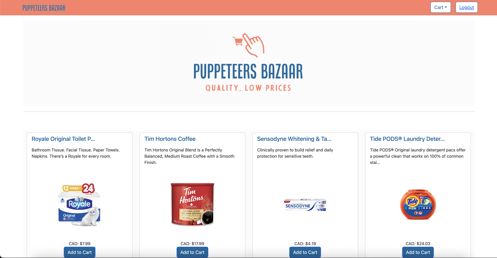

# Puppeteer's Bazaar

Puppeteer's Bazaar is an ecommerce website that offers a unique shopping experience for customers by providing price comparisons for products across multiple popular websites like Amazon, Loblaws, and Walmart. The website scrapes prices from these websites and displays them side-by-side, allowing customers to make an informed purchasing decision. The site's user-friendly interface makes it easy for customers to navigate and find the products they are looking for. Puppeteer's Bazaar aims to provide its customers with the best deals on the products they want to buy, making it an ideal destination for those who love to shop online.



## Table of Contents
- [Deployment](#deployment)
- [Technologies](#technologies)
- [Admin Functionalities](#admin-functionalities)
- [User Functionalities](#user-functionalities)
- [Puppeteer Functionality](#puppeteer-functionality)
- [Installation](#installation)
- [Usage](#usage)
- [Authors](#authors)

## Deployment

The application has been deployed to Heroku and can be accessed at https://puppeteers-bazaar.herokuapp.com/.

## Technologies

The technologies used in this application include:

- React
- MongoDB
- GraphQL/Apollo
- Express
- GraphQL
- dotenv
- JWT (for authentication)
- Heroku (for deployment)
- bootstrap (for styling)
- Puppeteer (for web scraping)

## Admin Functionalities

Admin users have access to the following functionalities:

- Adding new items to the database
- Editing existing items in the database
- Deleting items from the database
- Viewing a list of all users and their information
- Viewing a list of all orders and their information

#### Admin Credentials

- ADMIN_EMAIL: pamela@testmail.com
- ADMIN_PASSWORD: password12345

## User Functionalities

Non-admin users have access to the following functionalities:

- Creating an account
- Logging in and logging out
- Browsing and searching for items
- Adding items to a shopping cart
- Viewing the shopping cart and making changes to it

#### User Credentials

- USER_EMAIL: eholt@testmail.com
- USER_PASSWORD: password12345

## Puppeteer Functionality

Puppeteer is used in this application to scrape data for prices from external websites. The websites that are scraped include Amazon, Loblaws, and Walmart. 

The following steps outline how Puppeteer is used in this application:

1. When a user searches for a product, the search term is passed to the server.
2. The server then uses Puppeteer to navigate to the external websites and search for the product.
3. Puppeteer returns the relevant data (product name, image, price, etc.) to the server.
4. The server then sends the data to the client, where it is displayed to the user.

## Installation

To install the application locally, follow these steps:

1. Clone the repository to your local machine
2. Run `npm install` in both the root directory and the client directory
3. To install Puppeteer using the command line, you can use the following command:

```npm install puppeteer```

This will install the latest version of Puppeteer and its dependencies in your project.

4. Run `npm run develop` to start the application

## Usage

Once the application is running, users can create an account, log in, and browse household items from Amazon, Loblaws, and Walmart. They can also add items to their cart.

* Admin users can add, edit, and delete items from the database. They can also view a list of all users and edit the account type.
* Users are able to purchase items from the cart.


## Authors

This application was created by John Abounassar, Mandeep Aulakh and Mohamed Osman.